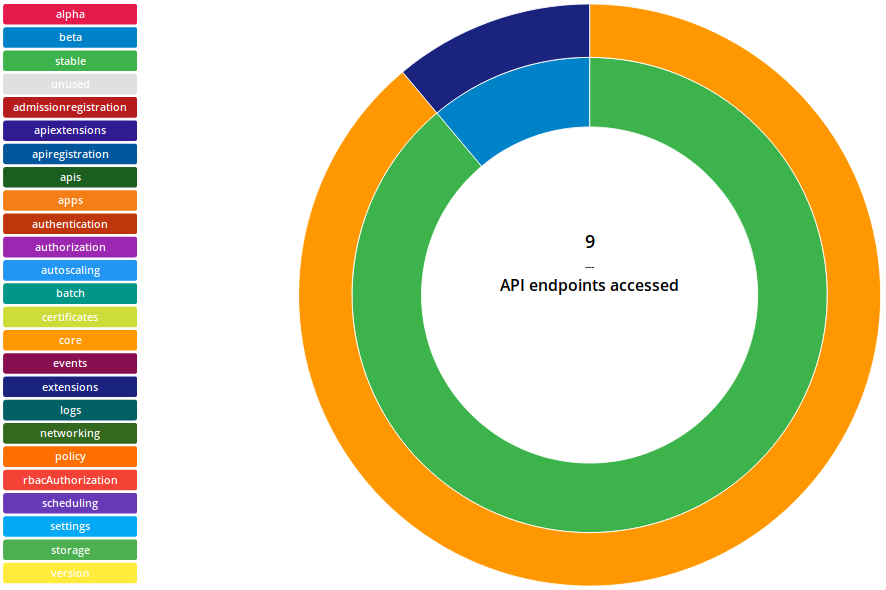
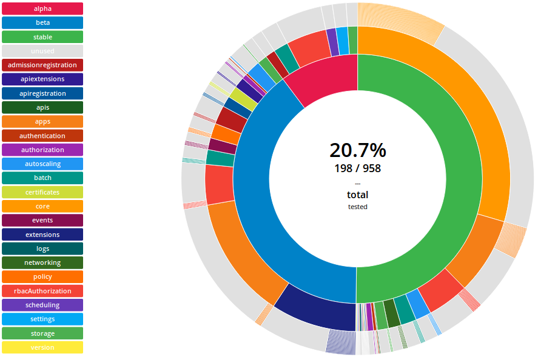
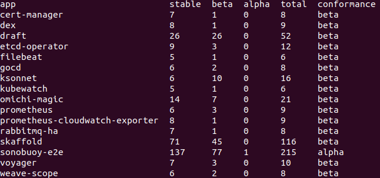

# APISnoop

Snooping on the Kubernetes OpenAPI communications

## Enabling Audit Logging

### GCE / terraform+kubeadm

We [modified](https://github.com/GoogleCloudPlatform/terraform-google-k8s-gce/pull/13/files) [GoogleCloudPlatform/terraform-google-gce](https://github.com/GoogleCloudPlatform/terraform-google-k8s-gce) to use the AdvancedAuditing / Audit feature gates available in kubernetes/kubeadm.
Thanks @danisla!

To utilize it, create a tf config using the above module.
Be sure to set your project and location.

```terraform
# save as my-auditable-cluster.tf
provider "google" {
  project     = "ii-coop"
  region      = "us-central1"
}
module "k8s" {
  source      = "github.com/ii/terraform-google-k8s-gce?ref=audit-logging"
  name        = "apisnoop"
  k8s_version = "1.10.2"
}
```

We can monitor our cloud-init progress on the master, then collect the audit logs directly from the apiserver (easier if we only have one master).

```
terraform init
terraform apply
MASTER_NODE=$(gcloud compute instances list | grep apisnoop.\*master | awk '{print $1}')
gcloud compute ssh $MASTER_NODE --command "sudo tail -f /var/log/cloud-init-output.log /var/log/cloud-init.log"
# master node is up when you see: service "kubernetes-dashboard" created
```

Find the apiserver container and tail the audit log to see every api request.

```
gcloud compute ssh $MASTER_NODE --command "sudo docker exec \$(sudo docker ps -a | grep kube-apiserver-amd64 | awk '{print \$1}') tail -f /var/log/kubernetes/audit/audit.log"
```

### Packet / kubicorn+kubeadm

The [packet/kubicorn walkthru](https://github.com/kubicorn/kubicorn/blob/master/docs/_documentation/packet-walkthrough.md) from @deitch only needs some minor changes.

We created a ./bootstrap/ folder with updated scripts to enable audit-logging

```
git clone https://github.com/cncf/apisnoop.git
cd apisnoop
export PACKET_APITOKEN=FOOBARBAZZ
# use ./bootstrap/packet_k8s_ubuntu_16.04_*.sh
export KUBICORN_FORCE_LOCAL_BOOTSTRAP=1
kubicorn create apisnoop --profile packet
# ensure clusterAPI.spec.providerConfig: project.name is set correctly
sed -ie s:kubicorn-apisnoop:YOUR-PROJECT:  _state/apisnoop/cluster.yaml
kubicorn apply apisnoop
```

Some interesting parts of the kubicorn logs:

```
# using our advanced audit-log setup
[ℹ]  Parsing bootstrap script from filesystem [bootstrap/packet_k8s_ubuntu_16.04_master.sh]
[✔]  Created Device [apisnoop.master-0]
```

Verbose bootstrap logging available in addition to the audit.log:

```
ssh root@$MASTER_NODE tail -f /var/log/cloud-init-output.log
ssh root@$MASTER_NODE tail -f /var/log/audit/audit.log
```

-----


## Auditing your KAPIC
### Capturing audit logs while your KAPIC is running

Tail the audit.log via ssh and redirect the output locally.

```shell
ssh $MASTER_NODE tail -f /var/log/kubernetes/audit/audit.log | tee MYKAPIC-audit.log
#^c when finished auditing
```

Creating a namespace and service accounts for your KAPIC to use will make filtering easier.

```shell
kubectl create ns $KAPP
helm install $REPO/$KAPP \
     --name $KAPP \
     --namespace $KAPP \
     --set serviceAccount.name=$KAPP \
     --set serviceAccount.create=true \
     --set rbac.create=true
```

At this point, drive the KAPIC with 'helm test' or it's own e2e suite.
Stop the logging, and optionally perform some filtering. ([gron](https://github.com/tomnomnom/gron) may prove useful)


## Loading audit logs into APISnoop

Once you have the audit logs for the app, you can turn them into an interactive graph of the endpoints and methods that were requested by the app.

Some setup is required
```
cd dev/audit-log-review
pip install -r requirements.txt
```

To load the audit log into the database
```
python logreview.py load-audit <audit log path> <app name>
```

Now that the log is in the database, lets start the webserver and have a look
```
python logreview.py start-server
```

Go to `http://localhost:9090` in a web browser

Click `Apps` then the app name and you will get a graph that looks similar to this:



### Loading e2e coverage test audit logs

To see the coverage graph from the Kubernetes e2e tests obtained from Sonobuoy or manually, load the logs using the name **e2e**
```
python logreview.py load-audit <audit log path> e2e
```

Now start the webserver
```
python logreview.py start-server
```
and go to `http://localhost:9090` in a web browser

Click `e2e` and you will get a graph that looks similar to this:



### Exporting data

If you want to export data as csv files

```
python logreview.py export-data <exporter name> <output csv path> <app name>
```
`exporter name` can be one of:

- **app-usage-categories**: breakdown of API categories an app is using
- **app-usage-summary**: summary of alpha / beta / stable API usage
- **app-usage-endpoints**: a list of endpoints and methods the app connects to
- **coverage-spreadsheet**: combines conformance google sheets data with endpoint hit counts

From the CSV, you can easily preview in terminal by using the command

`cat <output csv path> | tr "," " " | column -t`

Example output



