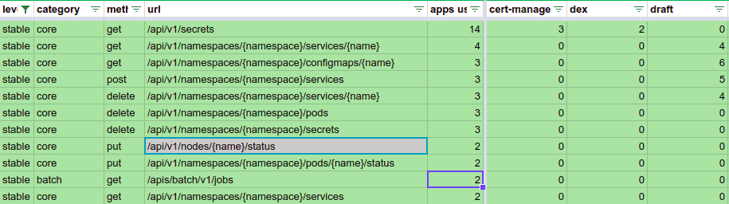

[](https://app.netlify.com/sites/apisnoop/deploys)

# APISnoop

Snooping on the Kubernetes OpenAPI communications

## Welcome to our really new / exploration level project.

### Why?
Our initial goal is to provide a useful indicator as to which Kubernetes APIs are used the most and don't yet have conformance tests. This is specifically to ensure we are testing APIs that are relevant, rather than just hitting all the endpoints. Our K8s API consumer/user journeys are an important model to drive this prioritization, in addition to providing insight into _how_ the APIs are being used.

Our currently rough output is the most promising visualization of how api groups endpoints and verbs are used today. The APISnoop Visualization presents in very clear terms how poor our current coverage actually is. Our high level graph shows our stable API's are mostly untested (the grey sections of the outer ring).

[](http://apisnoop.cncf.io/sunburst/index.html)


We also export the data to a csv / google sheet that clearly shows the most popular untested API endpoints.

[](https://docs.google.com/spreadsheets/d/1abhElzOpRDRVKaggT8nGODoh9od84fv0QET7Nfe_f7Y/edit?usp=sharing)

Highlighting the above untested stable core APIs:

[](http://apisnoop.cncf.io/sunburst/index.html)

Our Secondary goal is a Parallel Certification Program, using same machinery for Certified Kubernetes Provider, to certify set of Apps that utilize the Kubernetes API. ie. Istio, Skaffold, Draft => Require K8s 1.9 If you have 1.9, it will run those tools. If they utilize only v1/stable APIS they are guaranteed to run on at least the next K8s release.


### How?

In order to identify target applications to test, we define a Kubernetes API Consumer as a _KAPIC_.

We inspect the [advanced audit logs](https://kubernetes.io/docs/tasks/debug-application-cluster/audit/) to describe which APIs are called during KAPIC operations. For our initial data run we installed a small set of KAPIC helm charts and obverved which API groups are called. We used the [d3 libary](https://github.com/d3/d3/wiki/Gallery) to create [Sunburst Partition Graphs](https://bl.ocks.org/mbostock/4063423) center stable/beta/alpha with partitions for APIGroups then APICalls/Verbs.

The initial raw data is available within our [v0.0.1-audit-logs release](https://github.com/cncf/apisnoop/releases/tag/v0.0.1-audit-logs) and a simple interactive demo is running at http://apisnoop.cncf.io

### Meetings / Demos

#### Past
- [June 12th, 2018 - SIG Node - APISnoop initial mapping of endpoints to e2e tests](https://docs.google.com/presentation/d/1wrdBlLtHb_z5qmNwDDPrc9DRDs3Klpac83v8h5iAqjE/edit#slide=id.g37b1fc65d7_0_87)
- May 23rd, 2018 - Conformance WG - APISnoop: easing contribution and driving pod api utilization [Recording](https://www.youtube.com/watch?v=XJgK6jw_mPc&t=720)
- [May 10th, 2018 - SIG Architecture - APISnoop Introduction](https://docs.google.com/presentation/d/1JvWYSGWdiPq3YOINCJVUJaI4RVN642xSpzX9JY5HhTE/edit#slide=id.g37b1fc65d7_0_87) & [Recording](https://www.youtube.com/watch?v=gCTLdzsqzaY&feature=youtu.be&list=PL69nYSiGNLP2m6198LaLN6YahX7EEac5g&t=2635)
- [May 4th, 2018 - KubeCon Copenhagen - Deep Dive for Conformance WG](https://docs.google.com/presentation/d/16_qeQ4wIbUMUUIRjQ22QabdcEbZ9yucUWSn7PykuF0c/edit#slide=id.p1) & [Recording](https://www.youtube.com/watch?v=LAGhshWmJAs&feature=youtu.be&list=PLj6h78yzYM2N8GdbjmhVU65KYm_68qBmo&t=2)

## Enabling Audit Logging

kubeadm supports advanced audit logging in 1.10 and later.
Here are two examples using that approach:

### Packet / kubicorn+kubeadm

The [packet/kubicorn walkthru](https://github.com/kubicorn/kubicorn/blob/master/docs/_documentation/packet-walkthrough.md) from @deitch only needs some minor changes.

We created a ./bootstrap/ folder with updated scripts to enable audit-logging

```
git clone https://github.com/cncf/apisnoop.git
cd apisnoop
export PACKET_APITOKEN=FOOBARBAZZ
export PACKET_PROJECT=YOUR-PROJECT
# use ./bootstrap/packet_k8s_ubuntu_16.04_*.sh
export KUBICORN_FORCE_LOCAL_BOOTSTRAP=1
kubicorn create apisnoop --profile packet
# ensure clusterAPI.spec.providerConfig: project.name is set correctly
sed -ie "s:kubicorn-apisnoop:${PACKET_PROJECT}:"  _state/apisnoop/cluster.yaml
kubicorn apply apisnoop
```

Some interesting parts of the kubicorn logs:

```
# using our advanced audit-log setup
[ℹ]  Parsing bootstrap script from filesystem [bootstrap/packet_k8s_ubuntu_16.04_master.sh]
[✔]  Created Device [apisnoop.master-0]
```

Verbose bootstrap logging available in addition to the audit.log:

```
ssh root@$MASTER_NODE tail -f /var/log/cloud-init-output.log
ssh root@$MASTER_NODE tail -f /var/log/audit/audit.log
```

### GCE / terraform+kubeadm

We [modified](https://github.com/GoogleCloudPlatform/terraform-google-k8s-gce/pull/13/files) [GoogleCloudPlatform/terraform-google-gce](https://github.com/GoogleCloudPlatform/terraform-google-k8s-gce) to use the AdvancedAuditing / Audit feature gates available in kubernetes/kubeadm.
Thanks @danisla!

To utilize it, create a tf config using the above module.
Be sure to set your project and location.

```terraform
export CLUSTERNAME=foo
cat <EOF >>my.tf
# save as my-auditable-cluster.tf
provider "google" {
  project     = "ii-coop"
  region      = "us-central1"
}
module "k8s" {
  source      = "github.com/ii/terraform-google-k8s-gce?ref=audit-logging"
  name        = "${CLUSTERNAME}"
  k8s_version = "1.10.2"
}
EOF
```

We can monitor our cloud-init progress on the master, then collect the audit logs directly from the apiserver (easier if we only have one master).

```
terraform init
terraform apply
MASTER_NODE=$(gcloud compute instances list | grep ${CLUSTERNAME}.\*master | awk '{print $1}')
gcloud compute ssh $MASTER_NODE --command "sudo tail -f /var/log/cloud-init-output.log /var/log/cloud-init.log"
# master node is up when you see: service "kubernetes-dashboard" created
```

These clusters do not have a public api endpoint, portforwarding is required.

```
# get a working kubeconfig, you may need to portforward
gcloud compute ssh $MASTER_NODE -- -L 6443:127.0.0.1:6443
```

Copy the admin kubeconfig from the apiserver and set it to use the local portforward.

```shell
export KUBECONFIG=$PWD/kubeconfig
gcloud compute ssh $MASTER_NODE \
  --command "sudo KUBECONFIG=/etc/kubernetes/admin.conf kubectl config view --flatten" \
  > $KUBECONFIG
kubectl config set clusters.kubernetes.server https://127.0.0.1:6443
```

Find the apiserver container and tail the audit log to see every api request.

```
gcloud compute ssh $MASTER_NODE --command "sudo tail -f /var/log/audit/audit.log"
```

## Auditing your KAPIC
### Capturing audit logs while your KAPIC is running

Tail the audit.log via ssh and redirect the output locally.

```shell
ssh $MASTER_NODE tail -f /var/log/audit/audit.log | tee MYKAPIC-audit.log
#^c when finished auditing
```

Creating a namespace and service accounts for your KAPIC to use will make filtering easier.

```shell
kubectl create ns $KAPP
helm install $REPO/$KAPP \
     --name $KAPP \
     --namespace $KAPP \
     --set serviceAccount.name=$KAPP \
     --set serviceAccount.create=true \
     --set rbac.create=true
```

At this point, drive the KAPIC with 'helm test' or it's own e2e suite.

### Filtering your audit logs
Audit logs record everything happening on the API server.
We hope to make filtering for a particular KAPIC easier in the future.
Until then [gron](https://github.com/tomnomnom/gron) may prove useful.

## Loading audit logs into APISnoop

Once you have the audit logs for the app, you can turn them into an interactive graph of the endpoints and methods that were requested by the app.

Some setup is required
```
cd dev/audit-log-review
pip install -r requirements.txt
```

To load the audit log into the database
```
python logreview.py load-audit <audit log path> <app name>
```

Now that the log is in the database, lets start the webserver and have a look
```
python logreview.py start-server
```

Go to `http://localhost:9090` in a web browser

Click `Apps` then the app name and you will get a graph that looks similar to this:


### Loading e2e coverage test audit logs

To see the coverage graph from the Kubernetes e2e tests obtained from Sonobuoy or manually, load the logs using the name **e2e**
```
python logreview.py load-audit <audit log path> e2e
```

Now start the webserver
```
python logreview.py start-server
```
and go to `http://localhost:9090` in a web browser

Click `e2e` and you will get a graph that looks similar to this:


### Exporting data

If you want to export data as csv files

```
python logreview.py export-data <exporter name> <output csv path> <app name>
```
`exporter name` can be one of:

- **app-usage-categories**: breakdown of API categories an app is using
- **app-usage-summary**: summary of alpha / beta / stable API usage
- **app-usage-endpoints**: a list of endpoints and methods the app connects to
- **coverage-spreadsheet**: combines conformance google sheets data with endpoint hit counts

From the CSV, you can easily preview in terminal by using the command

`cat <output csv path> | tr "," " " | column -t`

Example output


