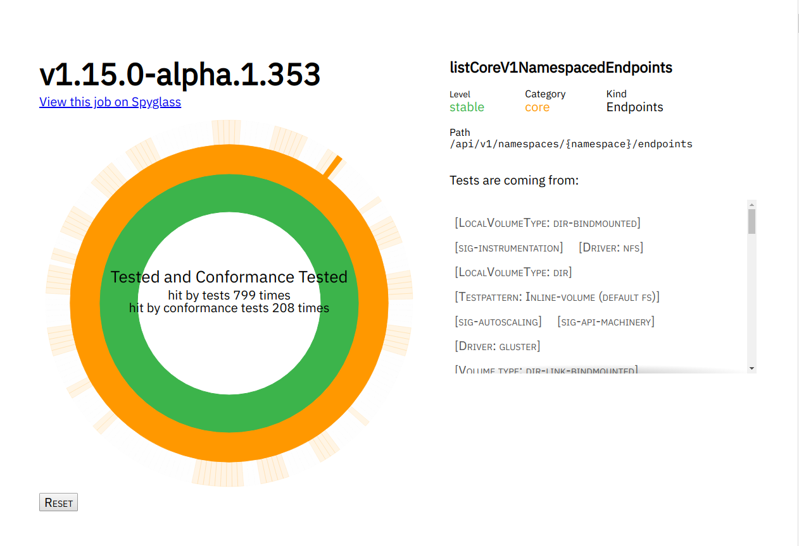

# APISnoop

Snooping on the Kubernetes OpenAPI communications

## Why?

Our initial goal is to provide a useful indicator as to which Kubernetes APIs are used the most and don't yet have conformance tests. This is specifically to ensure we are testing APIs that are relevant, rather than just hitting all the endpoints.

A secondary goal is to assist in the writing of new tests, by providing focus and context to test-writers.  APISnoop shows if an endpoint is tested, but also _how_ its tested, through highlighting which tests and test tags hit the endpoints and providing filtering tools to only look at the tests and endpoints that matter to you..
[](http://apisnoop.cncf.ci)

## How?

In order to identify target applications to test, we define a Kubernetes API Consumer as a _KAPIC_. We inspect the [advanced audit logs](https://kubernetes.io/docs/tasks/debug-application-cluster/audit/) to describe which APIs are called during KAPIC operations, mapping the API to the OpenAPI Spec to have consistent terminology.   We then visualize this data in a [Sunburst Partition Graphs](https://bl.ocks.org/mbostock/4063423) with stable/beta/alpha as the center, APIGroups(called categories in the OpenAPI Spec) as the second ring, and APICalls/Verbs (OperationID's in the spec) as the outer ring.e
The fetching and processing of audit logs, and the deployment of the data visualization, is built into the pipeline of APISnoop, which means we can display different sets of data, and visuals, per branch and pull request.  Visualizing a specific set of data is as simple as opening a pull request on the APISnoop repo, with your audit-logs specified in our [audit-sources.yaml](./audit-sources.yaml)

## Running APISNoop

### Start a Branch on this repo

This will allow for a new site to be deployed specifically for your data.

### Specifying Audit Logs

The audit logs to process are outlined in our [audit-sources.yaml](./audit-sources.yaml), located in the root of this repo.  Each field in this yaml is required, and explained below.

```yaml
# where the raw audit logs are located.
source: prow.k8s.io 
# which buckets you would like processed
buckets: 
  ci-kubernetes-e2e-gce-cos-k8sstable3-default:
# you can specify multiple jobs per bucket
# job should be explicitly set as strings.
    jobs:
      - '1121083339638312961'
  ci-kubernetes-e2e-gce-cos-k8sstable2-default:
    jobs:
      - '1121457989778149377'
  ci-kubernetes-e2e-gce-cos-k8sstable1-default:
    jobs:
      - '1121581392354873344'
  ci-kubernetes-e2e-gce-cos-k8sbeta-default:
    jobs:
      - '1121564030004105216'
  ci-kubernetes-e2e-gci-gce:
    jobs:
      - '1121334929389522946'
# which bucket and job shows on first page load of the site.
default-view:
  bucket: ci-kubernetes-e2e-gci-gce
  job: '1121334929389522946'

```

### Open a Pull Request in this repo

This will trigger a number of jobs to occur, which you can track in the pull request.  The main things happening are:
- We check audit-sources.yaml and use this to generate data.
- We store this processed data on Google Storage, in a specific gs:/apisnoop bucket.
- A site is built from the code in `app` and deployed to netlify.
- As part of the deployment we run ./update.sh to copy audit-sources.yaml to the app's public folder, and query gs://apisnoop to get the path to the processed logs.
- a deploy preview is generated by netlify, with a link provided in the details of our prow job.

### Viewing your Site

You can grab the link for the netlify preview in the Checks panel of the pull request, by clicking the details link next to ``netlify/apisnoop/deploy-preview`

## Exploring the Data through the Site

### The Sunburst

The core of a site is a sunburst visualization for each of your specified buckets and jobs.  By hovering over any part, you will see the percentage of tested and conformance tested endpoints for that particular grouping (whether its level, category, or OperationID).  By clicking on any level or category, you will zoom in so that section becomes the root of the sunburst.  By clicking on any section of the outer ring, it will lock that endpoint in place.

### Filtering

You can filter the endpoints available to the sunburst in our filters section, with `useragent`, `test`, and `test tag` as the currently available filters.

For each one, you can enter a Regex pattern, and we will create a grouping of useragents, tests, or test tags whose name matches that pattern.  We then filter the endpoints available to only those hit by the specified grouping.

This can be useful for seeing the percentage of your tests or test tags that are not yet conformant and how many endpoints they hit, or seeing how many endpoints hit by your useragent that are not tested or conformance tested.

You can clear the filter by hitting the X button next to the regex pattern.


### Endpoint Summary and Test Sequences

When you are hovered/zoomed into an endpoint, a summary card will appear to the right of the sunburst.  This will outline:
- the known groupings for this endpoint (its level, category, group, kind, and path).
- Whether it's tested or conformance tested.
- If Tested, which test tags hit it.

In addition, A list of the tests that hit this endpoint  will appear below the sunburst.  You can click on any test to see its full test sequence.

[example test sequence]('./docs/images/test_sequence.png' 'a list of endpoints with a timestamp for when they are hit')

### Sharing your site/filters

At any time you can share the URL of your site, which will retain the exact filtering you've set.  For example, you can share a view that has useragents and tests filters set, and which is locked into a specific endpoint, with the sequence for a specific test listed below.

## Contributing

### Contribution to Data Processing

As we make a fresh deployment per branchk, you can not only adjust the audit logs we look at, but the ways in which these audit logs are processed.

The core of the data processing is written in Python, and held in our [data-gen/](./data-gen) folder. 

### Contributions to the App

Our front-end site is written with React and Redux, and held in our [app/](./app) folder.  There is a README located within that folder with more details on the structure and patterns of the site.

## Other Resources

### Meetings / Demos
- [June 12th, 2018 - SIG Node - APISnoop initial mapping of endpoints to e2e tests](https://docs.google.com/presentation/d/1wrdBlLtHb_z5qmNwDDPrc9DRDs3Klpac83v8h5iAqjE/edit#slide=id.g37b1fc65d7_0_87)
- May 23rd, 2018 - Conformance WG - APISnoop: easing contribution and driving pod api utilization [Recording](https://www.youtube.com/watch?v=XJgK6jw_mPc&t=720)
- [May 10th, 2018 - SIG Architecture - APISnoop Introduction](https://docs.google.com/presentation/d/1JvWYSGWdiPq3YOINCJVUJaI4RVN642xSpzX9JY5HhTE/edit#slide=id.g37b1fc65d7_0_87) & [Recording](https://www.youtube.com/watch?v=gCTLdzsqzaY&feature=youtu.be&list=PL69nYSiGNLP2m6198LaLN6YahX7EEac5g&t=2635)
- [May 4th, 2018 - KubeCon Copenhagen - Deep Dive for Conformance WG](https://docs.google.com/presentation/d/16_qeQ4wIbUMUUIRjQ22QabdcEbZ9yucUWSn7PykuF0c/edit#slide=id.p1) & [Recording](https://www.youtube.com/watch?v=LAGhshWmJAs&feature=youtu.be&list=PLj6h78yzYM2N8GdbjmhVU65KYm_68qBmo&t=2)
