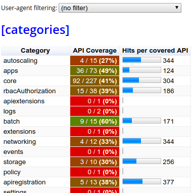

# E2E Coverage View

### Loading E2E audit logs into apisnoop

Once you have the audit logs, you can view an interactive table showing API endpoint coverage.

Some setup is required
```
cd dev/e2e-coverage-view
pip install -r requirements.txt
```

To load the audit log into the database
```
python import.py <audit log path>
```

Now that the log is in the database, lets start the webserver and have a look
```
python logreview.py
```

Go to `http://localhost:9090` in a web browser. You will get a graph that looks similar to this:



You can click on the entries to drill down through the categories and endpoint paths to see coverage
further down, and click on the breadcrumbs at the top to move back up.
